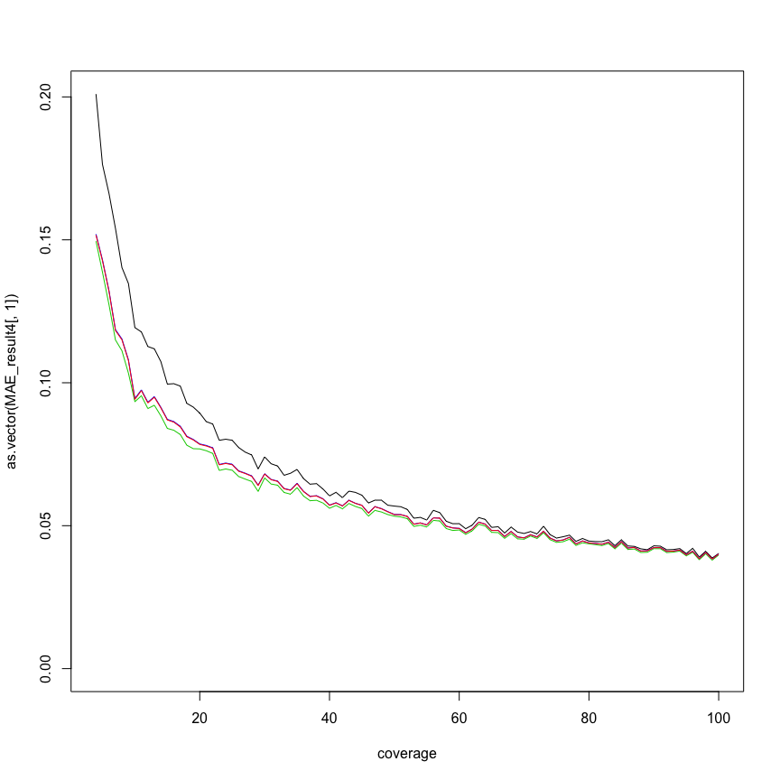

Evaluation functions:


```r
# mean squared error
MSE <- function(estimated,parameter){
  mean((estimated-parameter)^2)
}

# relative error
RE <- function(estimated,parameter){
  mean(abs(estimated-parameter)/parameter)
}

# mean absolute error
MAE <- function(estimated,parameter){
  mean(abs(estimated-parameter))
}
```


Setting parameters for simulated data:


```r
coverage = c(4:20)

true_parameters <- data.frame(p_m=c(0.1,0.3), p_h=c(.1,.1))
true_parameters
```

```
##   p_m p_h
## 1 0.1 0.1
## 2 0.3 0.1
```


Simulating the data:


```r
set.seed(122017)

n = 1000

MethylatedBS <- matrix(NA,ncol=length(coverage),nrow=n)
UnMethylatedBS <- matrix(NA,ncol=length(coverage),nrow=n)
MethylatedOxBS <- matrix(NA,ncol=length(coverage),nrow=n)
UnMethylatedOxBS <- matrix(NA,ncol=length(coverage),nrow=n)
MethylatedTAB <- matrix(NA,ncol=length(coverage),nrow=n)
UnMethylatedTAB <- matrix(NA,ncol=length(coverage),nrow=n)

for (i in 1:dim(true_parameters)[1])
{
  p_m = true_parameters$p_m[i]
  p_h = true_parameters$p_h[i]
  for (j in 1:length(coverage))
  {
    MethylatedBS[,j] <- rbinom(n, size = coverage[j], prob = (p_m + p_h))
    UnMethylatedBS[,j] <- coverage[j] - MethylatedBS[,j]
    
    MethylatedOxBS[,j] <- rbinom(n, size = coverage[j], prob = p_m)
    UnMethylatedOxBS[,j] <- coverage[j] - MethylatedOxBS[,j]
    
    MethylatedTAB[,j] <- rbinom(n, size = coverage[j], prob = p_h)
    UnMethylatedTAB[,j] <- coverage[j] - MethylatedTAB[,j]
  }
  
  save(MethylatedBS,UnMethylatedBS,MethylatedOxBS,UnMethylatedOxBS,MethylatedTAB,UnMethylatedTAB,file=paste0("simulatedCounts/",p_m,"-",p_h,".rda"))
}
```


Comparing the methods of BS and OxBS:


```r
library(OxyBS)
library(MLML2R)

# MLML EM
RE_result1 <- matrix(NA,nrow=length(coverage),ncol=dim(true_parameters)[1])
RMSE_result1 <- matrix(NA,nrow=length(coverage),ncol=dim(true_parameters)[1])
MAE_result1 <- matrix(NA,nrow=length(coverage),ncol=dim(true_parameters)[1])

#MLML Exact
RE_result2 <- matrix(NA,nrow=length(coverage),ncol=dim(true_parameters)[1])
RMSE_result2 <- matrix(NA,nrow=length(coverage),ncol=dim(true_parameters)[1])
MAE_result2 <- matrix(NA,nrow=length(coverage),ncol=dim(true_parameters)[1])

# OxyBS
RE_result3 <- matrix(NA,nrow=length(coverage),ncol=dim(true_parameters)[1])
RMSE_result3 <- matrix(NA,nrow=length(coverage),ncol=dim(true_parameters)[1])
MAE_result3 <- matrix(NA,nrow=length(coverage),ncol=dim(true_parameters)[1])

#Naive
RE_result4 <- matrix(NA,nrow=length(coverage),ncol=dim(true_parameters)[1])
RMSE_result4 <- matrix(NA,nrow=length(coverage),ncol=dim(true_parameters)[1])
MAE_result4 <- matrix(NA,nrow=length(coverage),ncol=dim(true_parameters)[1])


files <- list.files("simulatedCounts")

for (i in 1:dim(true_parameters)[1])
{
  p_m = true_parameters$p_m[i]
  p_h = true_parameters$p_h[i]
  load(paste0("simulatedCounts/",files[i]))
  beta_BS <- MethylatedBS/(MethylatedBS+UnMethylatedBS)
  beta_OxBS <- MethylatedOxBS/(MethylatedOxBS+UnMethylatedOxBS)
  N_BS <- MethylatedBS+UnMethylatedBS
  N_OxBS <- MethylatedOxBS+UnMethylatedOxBS
  hmC_naive <- beta_BS-beta_OxBS


  #results_em <- MLML(T.matrix = MethylatedBS, U.matrix = UnMethylatedBS, L.matrix = UnMethylatedOxBS, M.matrix = MethylatedOxBS,iterative = TRUE)
  results_exact <- MLML(T.matrix = MethylatedBS , U.matrix = UnMethylatedBS,L.matrix = UnMethylatedOxBS, M.matrix = MethylatedOxBS)
  
  for (j in 1:length(coverage))
  {
  result_OxyBS <- fitOxBS(betaBS=beta_BS[,j],betaOxBS=beta_OxBS[,j],signalBS=N_BS[,j],signalOxBS=N_OxBS[,j])

  #RE_result1[j,i] <- RE(results_em$hmC[,j],p_h)
  RE_result2[j,i] <- RE(results_exact$hmC[,j],p_h)
  RE_result3[j,i] <- RE(result_OxyBS[,3],p_h)
  RE_result4[j,i] <- RE(hmC_naive[,j],p_h)
  
  #RMSE_result1[j,i] <- sqrt(MSE(results_em$hmC[,j],p_h))
  RMSE_result2[j,i] <- sqrt(MSE(results_exact$hmC[,j],p_h))
  RMSE_result3[j,i] <- sqrt(MSE(result_OxyBS[,3],p_h))
  RMSE_result4[j,i] <- sqrt(MSE(hmC_naive[,j],p_h))
  
  #MAE_result1[j,i] <- MAE(results_em$hmC[,j],p_h)
  MAE_result2[j,i] <- MAE(results_exact$hmC[,j],p_h)
  MAE_result3[j,i] <- MAE(result_OxyBS[,3],p_h)
  MAE_result4[j,i] <- MAE(hmC_naive[,j],p_h)
  }
}
```

```
## Warning in log(1 - est5mC - est5hmC): NaNs produced

## Warning in log(1 - est5mC - est5hmC): NaNs produced

## Warning in log(1 - est5mC - est5hmC): NaNs produced

## Warning in log(1 - est5mC - est5hmC): NaNs produced

## Warning in log(1 - est5mC - est5hmC): NaNs produced

## Warning in log(1 - est5mC - est5hmC): NaNs produced

## Warning in log(1 - est5mC - est5hmC): NaNs produced

## Warning in log(1 - est5mC - est5hmC): NaNs produced

## Warning in log(1 - est5mC - est5hmC): NaNs produced

## Warning in log(1 - est5mC - est5hmC): NaNs produced

## Warning in log(1 - est5mC - est5hmC): NaNs produced

## Warning in log(1 - est5mC - est5hmC): NaNs produced

## Warning in log(1 - est5mC - est5hmC): NaNs produced

## Warning in log(1 - est5mC - est5hmC): NaNs produced
```

True parameters: 0.1, 0.1


