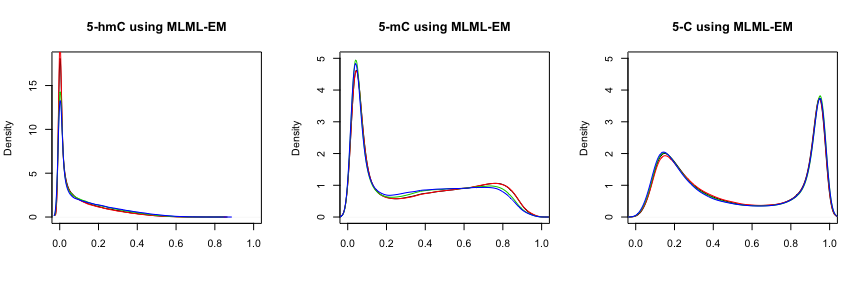
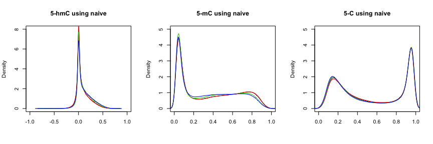

# Introduction


This document presents an example of the usage of the `MLML2R` package for R.

Install the R package using the following commands on the R console:


```r
install.packages("devtools")
devtools::install_github("samarafk/MLML2R")
library(MLML2R)
```


Proposed analyses of single-base profiling of either 5-hmC or 5-mC require combining data obtained using bisulfite conversion, oxidative bisulfite conversion or Tet-Assisted bisulfite conversion methods, but doing so naively produces inconsistent estimates of 5-mC or 5-hmC level [(Qu *et al.*, 2013)](https://www.ncbi.nlm.nih.gov/pmc/articles/PMC3789553/). 


The function `MLML` provides maximum likelihood estimates (MLE) for 5-hmC and 5-mC levels using data from any combination of two of the methods: BS-seq, TAB-seq or oxBS-seq. The function also provides MLE when combining these three methods.

The algorithm implemented in the `MLML` function is based on the Expectation-Maximization (EM) algorithm proposed by [Qu *et al.* (2013)](https://www.ncbi.nlm.nih.gov/pmc/articles/PMC3789553/). In addition, when only two methods are combined, our implementation is optimized, since we derived the exact MLE for 5-mC or 5-hmC levels, and the iterative EM algorithm is not needed. Our improved formulation can, thus, decrease analytic processing time and computational burden, common bottlenecks when processing single-base profiling data from thousands of samples.

Furthermore, our routine is flexible and can be used with both next generation sequencing and Infinium Methylation microarray data in the R-statistical language.


# Preparing dataset

We will use the dataset from [Field *et al.* (2015)](https://doi.org/10.1371/journal.pone.0118202), which consists of eight DNA samples from the same DNA source treated with oxBS-BS and hybridized to the Infinium 450K array.

The steps shown in this section follows the [vignette](https://kasperdanielhansen.github.io/genbioconductor/html/minfi.html) from `minfi` package.

## Getting publicly available data

We start with the steps to get the raw data from the GEO repository.
The dataset from [Field *et al.* (2015)](https://doi.org/10.1371/journal.pone.0118202) is available at GEO accession [GSE63179](https://www.ncbi.nlm.nih.gov/geo/query/acc.cgi?acc=GSE63179).

The sample was divided into four BS and four oxBS replicates.
 	
Platform used: GPL16304	Illumina HumanMethylation450 BeadChip [UBC enhanced annotation v1.0]

Samples:

* GSM1543269	brain-BS-1
* GSM1543270	brain-oxBS-3
* GSM1543271	brain-BS-2
* GSM1543272	brain-oxBS-4
* GSM1543273	brain-BS-3
* GSM1543274	brain-BS-4
* GSM1543275	brain-oxBS-1
* GSM1543276	brain-oxBS-2


To start this example we will need the following packages:


```r
library(minfi)
library(GEOquery)
```

which can be installed in R using the commands:

```r
source("http://www.bioconductor.org/biocLite.R")
biocLite(c("minfi", "GEOquery"))
```

It is usually best practice to start the analysis from the raw data, which in the case of the 450K array is a .IDAT file.
The raw files from \cite{10.1371/journal.pone.0118202} are deposited in GEO and can be downloaded by doing:


```r
getGEOSuppFiles("GSE63179")
untar("GSE63179/GSE63179_RAW.tar", exdir = "GSE63179/idat")
head(list.files("GSE63179/idat", pattern = "idat"))
```


Decompress the compressed IDAT files:


```r
idatFiles <- list.files("GSE63179/idat", pattern = "idat.gz$", full = TRUE)
sapply(idatFiles, gunzip, overwrite = TRUE)
```

```
## named list()
```


Now we read the IDAT files in the directory:


```r
rgSet <- read.metharray.exp("GSE63179/idat")
rgSet
```

```
## class: RGChannelSet 
## dim: 622399 8 
## metadata(0):
## assays(2): Green Red
## rownames(622399): 10600313 10600322 ... 74810490 74810492
## rowData names(0):
## colnames(8): GSM1543269_9373551079_R01C01
##   GSM1543270_9373551079_R01C02 ... GSM1543275_9373551079_R05C01
##   GSM1543276_9373551079_R06C01
## colData names(0):
## Annotation
##   array: IlluminaHumanMethylation450k
##   annotation: ilmn12.hg19
```


```r
pData(rgSet)
```

```
## DataFrame with 8 rows and 0 columns
```


```r
sampleNames(rgSet)
```

```
## [1] "GSM1543269_9373551079_R01C01" "GSM1543270_9373551079_R01C02"
## [3] "GSM1543271_9373551079_R02C01" "GSM1543272_9373551079_R02C02"
## [5] "GSM1543273_9373551079_R03C01" "GSM1543274_9373551079_R04C01"
## [7] "GSM1543275_9373551079_R05C01" "GSM1543276_9373551079_R06C01"
```

The file names consists of a GEO identifier (the GSM part) followed by a standard IDAT naming convention with a 10 digit number which is an array identifier followed by an identifier of the form R01C01. This is because each array actually allows for the hybridization of 12 samples in a 6x2 arrangement. The 9373551079_R01C01 means row 1 and column 1 on chip 9373551079. 

We need to identify the samples from different methods: BS-conversion, oxBS-conversion.


```r
geoMat <- getGEO("GSE63179")
pD.all <- pData(geoMat[[1]])
pD <- pD.all[, c("title", "geo_accession", "characteristics_ch1.1", "characteristics_ch1.2","characteristics_ch1.3")]
pD
```


```
##                   title geo_accession characteristics_ch1.1
## GSM1543269   brain-BS-1    GSM1543269          gender: Male
## GSM1543270 brain-oxBS-3    GSM1543270          gender: Male
## GSM1543271   brain-BS-2    GSM1543271          gender: Male
## GSM1543272 brain-oxBS-4    GSM1543272          gender: Male
## GSM1543273   brain-BS-3    GSM1543273          gender: Male
## GSM1543274   brain-BS-4    GSM1543274          gender: Male
## GSM1543275 brain-oxBS-1    GSM1543275          gender: Male
## GSM1543276 brain-oxBS-2    GSM1543276          gender: Male
##            characteristics_ch1.2 characteristics_ch1.3
## GSM1543269               age: 25    bisulfite_proc: BS
## GSM1543270               age: 25  bisulfite_proc: oxBS
## GSM1543271               age: 25    bisulfite_proc: BS
## GSM1543272               age: 25  bisulfite_proc: oxBS
## GSM1543273               age: 25    bisulfite_proc: BS
## GSM1543274               age: 25    bisulfite_proc: BS
## GSM1543275               age: 25  bisulfite_proc: oxBS
## GSM1543276               age: 25  bisulfite_proc: oxBS
```


```r
names(pD)[c(3,4,5)] <- c("gender", "age","method")
pD$gender <- sub("^gender: ", "", pD$gender)
pD$age <- sub("^age: ", "", pD$age)
pD$method <- sub("^bisulfite_proc: ","",pD$method)
```

We now need to merge this pheno data into the methylation data. The following are commands to make sure we have the same row identifier in both datasets before merging.


```r
sampleNames(rgSet) <- sapply(sampleNames(rgSet),function(x) strsplit(x,"_")[[1]][1])
rownames(pD) <- pD$geo_accession
pD <- pD[sampleNames(rgSet),]
pData(rgSet) <- as(pD,"DataFrame")
rgSet
```

```
## class: RGChannelSet 
## dim: 622399 8 
## metadata(0):
## assays(2): Green Red
## rownames(622399): 10600313 10600322 ... 74810490 74810492
## rowData names(0):
## colnames(8): GSM1543269 GSM1543270 ... GSM1543275 GSM1543276
## colData names(5): title geo_accession gender age method
## Annotation
##   array: IlluminaHumanMethylation450k
##   annotation: ilmn12.hg19
```


## Preprocessing

We refer the reader to the `minfi` package tutorials for more preprocessing options.


We need to install the required package bellow:

```r
source("https://bioconductor.org/biocLite.R")
biocLite("IlluminaHumanMethylation450kmanifest")
```


First, we removed probes with detection p-value <0.01 in any of the 8 arrays. The function `detectionP` identifies failed positions defined as both the methylated and unmethylated channel reporting background signal levels.


```r
detP <- detectionP(rgSet)
failed <- detP >0.01
## Keep probes which failed in at most maxFail arrays (0 = the probe passed in all arrays)
maxFail<- 0
keep_probes <- rowSums(failed) <= maxFail
```

We kept $83\%$ of the probes according to this criterion.


The `rgSet` object is a class called `RGChannelSet` which represents two color data with a green and a red channel. We will use, as input in the `MLML` funcion, a `MethylSet`, which contains the methylated and unmethylated signals. The most basic way to construct a `MethylSet` is to using the function `preprocessRaw` which uses the array design to match up the different probes and color channels to construct the methylated and unmethylated signals. Here we will use the `preprocessNoob` function, which does the preprocessing and returns a `MethylSet`.


Arrays were then normalized using the Noob/ssNoob preprocessing method for Infinium methylation microarrays.


From a `MethylSet` it is easy to compute Beta values, defined as:

Beta = Meth / (Meth + Unmeth + c)

The c constant is chosen to avoid dividing with small values. Illumina uses a default of c=100. The function `getBeta` from `minfi` package can be used to obtain the Beta values.


```r
MSet.noob<- preprocessNoob(rgSet[keep_probes,])
```

```
## [preprocessNoob] Applying R/G ratio flip to fix dye bias...
```

```r
densityPlot(MSet.noob, sampGroups= pData(rgSet)$method,
main= sprintf('Beta values for filtered probes (n= %s)', nrow(MSet.noob)))
```

<!-- -->


# Using the `MLML2R` package

After all the preprocessing procedures, we now can use the `MLML2R` package to obtain the maximum likelihood estimates for the 5-hmC and 5-mC levels.

Install the R package using the following commands on the R console:


```r
install.packages("devtools")
devtools::install_github("samarafk/MLML2R")
```


Prepare de input data:


```r
MethylatedBS <- getMeth(MSet.noob)[,c(1,3,5,6)]
UnMethylatedBS <- getUnmeth(MSet.noob)[,c(1,3,5,6)]

MethylatedOxBS <- getMeth(MSet.noob)[,c(7,8,2,4)]
UnMethylatedOxBS <- getUnmeth(MSet.noob)[,c(7,8,2,4)]
```


Getting the MLE estimates using EM-algorithm:


```r
library(MLML2R)
results_em <- MLML(Tc = MethylatedBS , Uc = UnMethylatedBS, Lc = UnMethylatedOxBS, Mc = MethylatedOxBS,tol=0.0001,iterative=TRUE)
```


Plot of the results (we have 4 replicates)




Getting the constrained exact MLE estimates:


```r
library(MLML2R)
results_exact <- MLML(Tc = MethylatedBS , Uc = UnMethylatedBS, Lc = UnMethylatedOxBS, Mc = MethylatedOxBS)
```


Plot of the results (we have 4 replicates)


# Other methods to obtain the estimates

## Naive estimates

The naive approach to obtain 5-hmC levels is $\beta_{BS} -  \beta_{OxBS}$. This approach results in negative values for the 5-hmC levels.


```r
beta_BS <- getBeta(MSet.noob)[,c(1,3,5,6)]
beta_OxBS <- getBeta(MSet.noob)[,c(7,8,2,4)]
hmC_naive <- beta_BS-beta_OxBS
C_naive <- 1-beta_BS
mC_naive <- beta_OxBS
```





## `OxyBS` estimates

For the specific case where only ox-BS and BS data are available, `OxyBS` package from [Houseman *et al.* (2016)](https://www.ncbi.nlm.nih.gov/pmc/articles/PMC4978924/) can be use to obtain estimates.


```r
library(OxyBS)

# Methylated signals from the BS and oxBS arrays
methBS <- MethylatedBS
methOxBS <- MethylatedOxBS
# Unmethylated signals from the BS and oxBS arrays
unmethBS <- UnMethylatedBS
unmethOxBS <- UnMethylatedOxBS

# Calculate Total Signals
signalBS <- methBS+unmethBS
signalOxBS <- methOxBS+unmethOxBS

# Calculate Beta Values
betaBS <- methBS/signalBS
betaOxBS <- methOxBS/signalOxBS

####################################################
# 4. Apply fitOxBS function to preprocessed values
####################################################

# Select the number of CpGs and Subjects to which the method will be applied 
nCpGs <- dim(unmethOxBS)[1]
nSpecimens <- dim(unmethOxBS)[2]

# Create container for the OxyBS results
MethOxy <- array(NA,dim=c(nCpGs,nSpecimens,3))
dimnames(MethOxy) <- list(
  rownames(methBS)[1:nCpGs],
  colnames(methBS)[1:nSpecimens], c("C","5mC","5hmC"))

# Process results (one array at a time, slow)
for(i in 1:nSpecimens){
MethOxy[,i,] <-fitOxBS(betaBS[,i],betaOxBS[,i],signalBS[,i],signalOxBS[,i])
}
```


Plot of the results (we have 4 replicates)


```r
par(mfrow =c(1,3)) 
plot(density(MethOxy[,1,3]),main= "5-hmC using OxyBS",xlab="")
lines(density(MethOxy[,2,3]),col=2)
lines(density(MethOxy[,3,3]),col=3)
lines(density(MethOxy[,4,3]),col=4)

plot(density(MethOxy[,1,2]),main= "5-mC using OxyBS",ylim=c(0,5),xlab="")
lines(density(MethOxy[,2,2]),col=2)
lines(density(MethOxy[,3,2]),col=3)
lines(density(MethOxy[,4,2]),col=4)

plot(density(MethOxy[,1,1]),main= "5-C using OxyBS",ylim=c(0,5),xlab="")
lines(density(MethOxy[,2,1]),col=2)
lines(density(MethOxy[,3,1]),col=3)
lines(density(MethOxy[,4,1]),col=4)
```


## `oxBS.MLE` estimates

`ENmix` package had the function `oxBS.MLE` from [Xu *et al.* (2016)](https://www.ncbi.nlm.nih.gov/pubmed/27522082) that can be uses to obtain estimates for the specific case where ox-BS and BS data are available.


```r
beta_BS <- getBeta(MSet.noob)[,c(1,3,5,6)]
beta_OxBS <- getBeta(MSet.noob)[,c(7,8,2,4)]
N_BS <- getCN(MSet.noob)[,c(1,3,5,6)]
N_OxBS <- getCN(MSet.noob)[,c(7,8,2,4)]
colnames(beta_BS) <- c("rep1","rep2","rep3","rep4")
colnames(beta_OxBS) <- c("rep1","rep2","rep3","rep4")
colnames(N_BS) <- c("rep1","rep2","rep3","rep4")
colnames(N_OxBS) <- c("rep1","rep2","rep3","rep4")

library(ENmix)
oxBSMLEresults <- oxBS.MLE(beta.BS=beta_BS,beta.oxBS=beta_OxBS,
                           N.BS=N_BS,N.oxBS=N_OxBS)
```


## Comparison of 5-hmC estimates from different methods


## Comparison of processing times from different methods


```r
library(OxyBS)
library(microbenchmark)
library(MLML2R)
signalBS <- MethylatedBS+UnMethylatedBS
signalOxBS <- MethylatedOxBS+UnMethylatedOxBS
betaBS <- MethylatedBS/signalBS
betaOxBS <- MethylatedOxBS/signalOxBS

nCpGs <- dim(UnMethylatedOxBS)[1]
nSpecimens <- dim(UnMethylatedOxBS)[2]
MethOxy1 <- array(NA,dim=c(nCpGs,nSpecimens,3))
dimnames(MethOxy1) <- list(
  rownames(MethylatedBS)[1:nCpGs],
  colnames(MethylatedBS)[1:nSpecimens], c("C","5mC","5hmC"))

oxyBS <- function()
{
  for(i in 1:nSpecimens){
MethOxy1[,i,] <-fitOxBS(betaBS[,i],betaOxBS[,i],signalBS[,i],signalOxBS[,i])
  }
}

mbm = microbenchmark(
  EXACT = MLML(Tc = MethylatedBS , Uc = UnMethylatedBS, Lc = UnMethylatedOxBS, 
               Mc = MethylatedOxBS),
  EM = MLML(Tc = MethylatedBS , Uc = UnMethylatedBS, Lc = UnMethylatedOxBS, 
            Mc = MethylatedOxBS,tol=0.00001,iterative=TRUE),
  oxBSMLE = oxBS.MLE(beta.BS=beta_BS,beta.oxBS=beta_OxBS,
                     N.BS=N_BS,N.oxBS=N_OxBS),
  oxyBS_res = oxyBS(),
  times=1)
```


| Method    |      Function           |  Package | Time (Seconds)                             |
|-----------|:-----------------------:|---------:|-------------------------------------------:|
| Iterative |  `MLML` (`tol=0.00001,iterative=TRUE`) | `MLML2R` | 138.879  |
| Iterative |  `fitOxBS`              | `OxyBS`  | 2850.424  |
| Closed-form analytical |  `MLML` (`iterative=FALSE`) | `MLML2R` | 0.477  |
| Closed-form analytical |  `oxBS.MLE` | `ENmix` | 0.699  |

