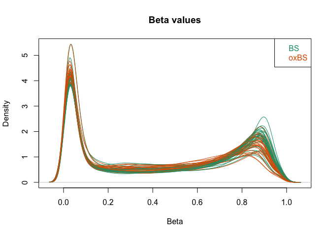
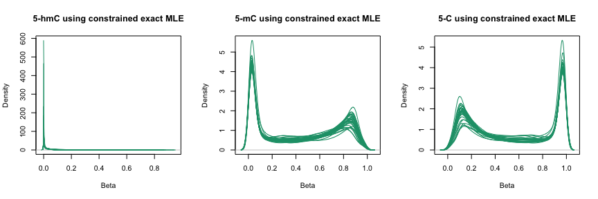
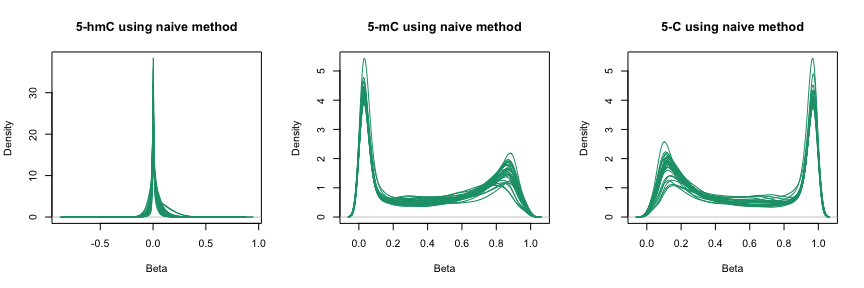
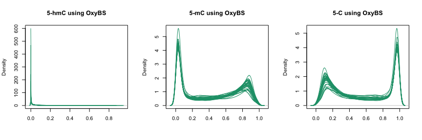
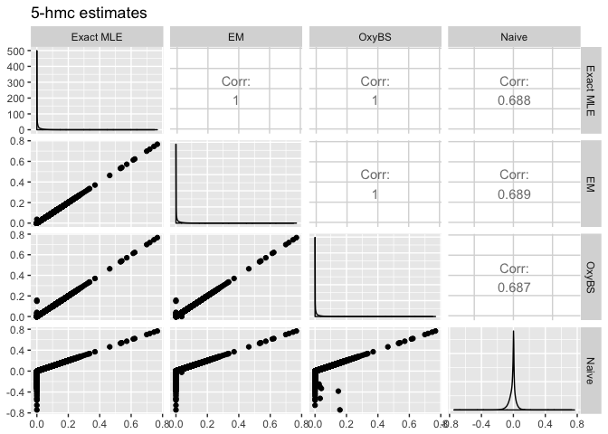
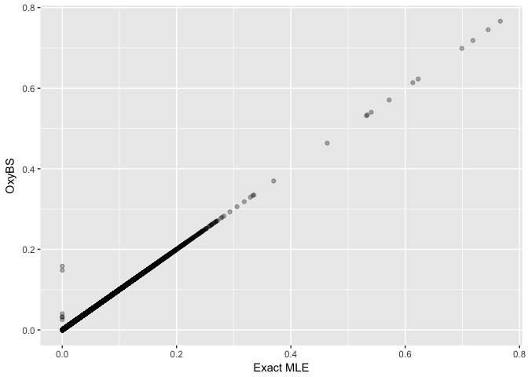
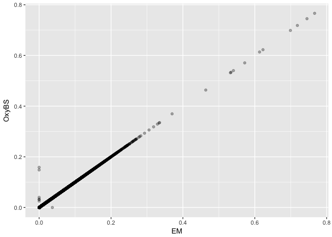

# Introduction


This document presents an example of the usage of the `MLML2R` package for R.

Install the R package using the following commands on the R console:


```r
install.packages("devtools")
devtools::install_github("samarafk/MLML2R")
library(MLML2R)
```


Proposed analyses of single-base profiling of either 5-hmC or 5-mC require combining data obtained using bisulfite conversion, oxidative bisulfite conversion or Tet-Assisted bisulfite conversion methods, but doing so naively produces inconsistent estimates of 5-mC or 5-hmC level [(Qu *et al.*, 2013)](https://www.ncbi.nlm.nih.gov/pmc/articles/PMC3789553/). 


The function `MLML` provides maximum likelihood estimates (MLE) for 5-hmC and 5-mC levels using data from any combination of two of the methods: BS-seq, TAB-seq or oxBS-seq. The function also provides MLE when combining these three methods.

The algorithm implemented in the `MLML` function is based on the Expectation-Maximization (EM) algorithm proposed by [Qu *et al.* (2013)](https://www.ncbi.nlm.nih.gov/pmc/articles/PMC3789553/). In addition, when only two methods are combined, our implementation is optimized, since we derived the constrained exact MLE in analytical form for 5-mC or 5-hmC levels, and the iterative EM algorithm is not needed. Our improved formulation can, thus, decrease analytic processing time and computational burden, common bottlenecks when processing single-base profiling data from thousands of samples.

Furthermore, our routine is flexible and can be used with both next generation sequencing and Infinium Methylation microarray data in the R-statistical language.


# Preparing dataset

We will use the dataset from [Johnson *et al.* (2016)](https://www.ncbi.nlm.nih.gov/pubmed/27886174), which consists of 30 DNA samples from glioblastoma tumors treated with oxBS-BS and hybridized to the Infinium 450K array.

The steps shown in this section follows the [vignette](https://kasperdanielhansen.github.io/genbioconductor/html/minfi.html) from `minfi` package.

## Getting publicly available data

We start with the steps to get the raw data from the GEO repository.
The dataset from [Johnson *et al.* (2016)](https://www.ncbi.nlm.nih.gov/pubmed/27886174) is available at GEO accession [GSE73895](https://www.ncbi.nlm.nih.gov/geo/query/acc.cgi?acc=GSE73895).

The sample was divided into four BS and four oxBS replicates.
 	
Platform used: 	GPL13534	Illumina HumanMethylation450 BeadChip (HumanMethylation450_15017482)


This example has the following dependencies:


```r
library(minfi)
library(GEOquery)
```

Use the following commands to install these packages in R:

```r
source("http://www.bioconductor.org/biocLite.R")
biocLite(c("minfi", "GEOquery"))
```


```r
getGEOSuppFiles("GSE73895")
untar("GSE73895/GSE73895_RAW.tar", exdir = "GSE73895/idat")
head(list.files("GSE73895/idat", pattern = "idat"))
```


Decompress the compressed IDAT files:


```r
idatFiles <- list.files("GSE73895/idat", pattern = "idat.gz$", full = TRUE)
sapply(idatFiles, gunzip, overwrite = TRUE)
```

```
## named list()
```


Now we read the IDAT files in the directory:


```r
rgSet <- read.metharray.exp("GSE73895/idat")
rgSet
```

```
## class: RGChannelSet 
## dim: 622399 60 
## metadata(0):
## assays(2): Green Red
## rownames(622399): 10600313 10600322 ... 74810490 74810492
## rowData names(0):
## colnames(60): GSM1905306_3999941120_R03C01
##   GSM1905307_3999941120_R05C01 ... GSM1905364_3999876055_R05C02
##   GSM1905365_3999876055_R03C01
## colData names(0):
## Annotation
##   array: IlluminaHumanMethylation450k
##   annotation: ilmn12.hg19
```


```r
pData(rgSet)
```

```
## DataFrame with 60 rows and 0 columns
```


```r
sampleNames(rgSet)
```

```
##  [1] "GSM1905306_3999941120_R03C01" "GSM1905307_3999941120_R05C01"
##  [3] "GSM1905308_3999941120_R03C02" "GSM1905309_3999941120_R02C02"
##  [5] "GSM1905310_3999941120_R05C02" "GSM1905311_3999941120_R04C01"
##  [7] "GSM1905312_3999941120_R01C01" "GSM1905313_3999941120_R04C02"
##  [9] "GSM1905314_3999941120_R01C02" "GSM1905315_3999941120_R02C01"
## [11] "GSM1905316_3999941120_R06C02" "GSM1905317_3999941120_R06C01"
## [13] "GSM1905318_3999941129_R02C02" "GSM1905319_3999941129_R04C01"
## [15] "GSM1905320_3999876055_R01C01" "GSM1905321_3999876055_R04C02"
## [17] "GSM1905322_3999876055_R06C01" "GSM1905323_3999876055_R04C01"
## [19] "GSM1905324_3999941129_R05C02" "GSM1905325_3999941129_R03C01"
## [21] "GSM1905326_3999941129_R05C01" "GSM1905327_3999941129_R01C01"
## [23] "GSM1905328_3999941129_R03C02" "GSM1905329_3999941129_R01C02"
## [25] "GSM1905330_3999840044_R01C02" "GSM1905331_3999840044_R02C02"
## [27] "GSM1905332_3999840044_R04C02" "GSM1905333_3999840044_R02C01"
## [29] "GSM1905334_3999840044_R04C01" "GSM1905335_3999840044_R03C02"
## [31] "GSM1905336_3999840044_R03C01" "GSM1905337_3999840044_R05C02"
## [33] "GSM1905338_3999840069_R05C02" "GSM1905339_3999840069_R04C01"
## [35] "GSM1905340_3999840044_R06C02" "GSM1905341_3999840044_R06C01"
## [37] "GSM1905342_3999840069_R01C02" "GSM1905343_3999840069_R05C01"
## [39] "GSM1905344_3999840069_R01C01" "GSM1905345_3999840069_R03C02"
## [41] "GSM1905346_3999840069_R06C01" "GSM1905347_3999840069_R04C02"
## [43] "GSM1905348_3999840044_R05C01" "GSM1905349_3999840044_R01C01"
## [45] "GSM1905350_3999840069_R02C01" "GSM1905351_3999840069_R06C02"
## [47] "GSM1905352_3999840069_R03C01" "GSM1905353_3999840069_R02C02"
## [49] "GSM1905354_3999876055_R02C01" "GSM1905355_3999876055_R02C02"
## [51] "GSM1905356_3999876055_R03C02" "GSM1905357_3999876055_R05C01"
## [53] "GSM1905358_3999876055_R06C02" "GSM1905359_3999876055_R01C02"
## [55] "GSM1905360_3999941129_R06C01" "GSM1905361_3999941129_R06C02"
## [57] "GSM1905362_3999941129_R02C01" "GSM1905363_3999941129_R04C02"
## [59] "GSM1905364_3999876055_R05C02" "GSM1905365_3999876055_R03C01"
```

The file names consists of a GEO identifier (the GSM part) followed by a standard IDAT naming convention with a 10 digit number which is an array identifier followed by an identifier of the form R01C01. This is because each array actually allows for the hybridization of 12 samples in a 6x2 arrangement. The 3999941120_R03C01 means row 3 and column 1 on chip 3999941120. 

We need to identify the samples from different methods: BS-conversion, oxBS-conversion.


```r
geoMat <- getGEO("GSE73895")
pD.all <- pData(geoMat[[1]])
pD <- pD.all[, c("title", "geo_accession", "characteristics_ch1", "characteristics_ch1.2","characteristics_ch1.3")]
pD
```


```
##                     title geo_accession characteristics_ch1
## GSM1905306    tissue_1_BS    GSM1905306      gender: Female
## GSM1905307  tissue_1_oxBS    GSM1905307      gender: Female
## GSM1905308    tissue_2_BS    GSM1905308      gender: Female
## GSM1905309  tissue_2_oxBS    GSM1905309      gender: Female
## GSM1905310    tissue_3_BS    GSM1905310        gender: Male
## GSM1905311  tissue_3_oxBS    GSM1905311        gender: Male
## GSM1905312    tissue_4_BS    GSM1905312        gender: Male
## GSM1905313  tissue_4_oxBS    GSM1905313        gender: Male
## GSM1905314    tissue_5_BS    GSM1905314        gender: Male
## GSM1905315  tissue_5_oxBS    GSM1905315        gender: Male
## GSM1905316    tissue_6_BS    GSM1905316        gender: Male
## GSM1905317  tissue_6_oxBS    GSM1905317        gender: Male
## GSM1905318    tissue_7_BS    GSM1905318      gender: Female
## GSM1905319  tissue_7_oxBS    GSM1905319      gender: Female
## GSM1905320    tissue_8_BS    GSM1905320      gender: Female
## GSM1905321  tissue_8_oxBS    GSM1905321      gender: Female
## GSM1905322    tissue_9_BS    GSM1905322      gender: Female
## GSM1905323  tissue_9_oxBS    GSM1905323      gender: Female
## GSM1905324   tissue_10_BS    GSM1905324        gender: Male
## GSM1905325 tissue_10_oxBS    GSM1905325        gender: Male
## GSM1905326   tissue_11_BS    GSM1905326        gender: Male
## GSM1905327 tissue_11_oxBS    GSM1905327        gender: Male
## GSM1905328   tissue_12_BS    GSM1905328      gender: Female
## GSM1905329 tissue_12_oxBS    GSM1905329      gender: Female
## GSM1905330   tissue_13_BS    GSM1905330        gender: Male
## GSM1905331 tissue_13_oxBS    GSM1905331        gender: Male
## GSM1905332   tissue_14_BS    GSM1905332        gender: Male
## GSM1905333 tissue_14_oxBS    GSM1905333        gender: Male
## GSM1905334   tissue_15_BS    GSM1905334        gender: Male
## GSM1905335 tissue_15_oxBS    GSM1905335        gender: Male
## GSM1905336   tissue_16_BS    GSM1905336      gender: Female
## GSM1905337 tissue_16_oxBS    GSM1905337      gender: Female
## GSM1905338   tissue_17_BS    GSM1905338        gender: Male
## GSM1905339 tissue_17_oxBS    GSM1905339        gender: Male
## GSM1905340   tissue_18_BS    GSM1905340        gender: Male
## GSM1905341 tissue_18_oxBS    GSM1905341        gender: Male
## GSM1905342   tissue_19_BS    GSM1905342      gender: Female
## GSM1905343 tissue_19_oxBS    GSM1905343      gender: Female
## GSM1905344   tissue_20_BS    GSM1905344        gender: Male
## GSM1905345 tissue_20_oxBS    GSM1905345        gender: Male
## GSM1905346   tissue_21_BS    GSM1905346      gender: Female
## GSM1905347 tissue_21_oxBS    GSM1905347      gender: Female
## GSM1905348   tissue_22_BS    GSM1905348      gender: Female
## GSM1905349 tissue_22_oxBS    GSM1905349      gender: Female
## GSM1905350   tissue_23_BS    GSM1905350      gender: Female
## GSM1905351 tissue_23_oxBS    GSM1905351      gender: Female
## GSM1905352   tissue_24_BS    GSM1905352      gender: Female
## GSM1905353 tissue_24_oxBS    GSM1905353      gender: Female
## GSM1905354   tissue_25_BS    GSM1905354        gender: Male
## GSM1905355 tissue_25_oxBS    GSM1905355        gender: Male
## GSM1905356   tissue_26_BS    GSM1905356        gender: Male
## GSM1905357 tissue_26_oxBS    GSM1905357        gender: Male
## GSM1905358   tissue_27_BS    GSM1905358        gender: Male
## GSM1905359 tissue_27_oxBS    GSM1905359        gender: Male
## GSM1905360   tissue_28_BS    GSM1905360        gender: Male
## GSM1905361 tissue_28_oxBS    GSM1905361        gender: Male
## GSM1905362   tissue_29_BS    GSM1905362        gender: Male
## GSM1905363 tissue_29_oxBS    GSM1905363        gender: Male
## GSM1905364   tissue_30_BS    GSM1905364        gender: Male
## GSM1905365 tissue_30_oxBS    GSM1905365        gender: Male
##                   characteristics_ch1.2 characteristics_ch1.3
## GSM1905306  survival time (months): 1.1     subject age: 77.6
## GSM1905307  survival time (months): 1.1     subject age: 77.6
## GSM1905308 survival time (months): 53.3     subject age: 45.3
## GSM1905309 survival time (months): 53.3     subject age: 45.3
## GSM1905310  survival time (months): 0.6     subject age: 69.7
## GSM1905311  survival time (months): 0.6     subject age: 69.7
## GSM1905312   survival time (months): 14       subject age: 55
## GSM1905313   survival time (months): 14       subject age: 55
## GSM1905314  survival time (months): 0.6     subject age: 83.7
## GSM1905315  survival time (months): 0.6     subject age: 83.7
## GSM1905316 survival time (months): 25.9     subject age: 58.3
## GSM1905317 survival time (months): 25.9     subject age: 58.3
## GSM1905318 survival time (months): 30.2     subject age: 68.9
## GSM1905319 survival time (months): 30.2     subject age: 68.9
## GSM1905320  survival time (months): 1.1     subject age: 67.6
## GSM1905321  survival time (months): 1.1     subject age: 67.6
## GSM1905322    survival time (months): 5     subject age: 74.3
## GSM1905323    survival time (months): 5     subject age: 74.3
## GSM1905324 survival time (months): 21.3     subject age: 62.7
## GSM1905325 survival time (months): 21.3     subject age: 62.7
## GSM1905326  survival time (months): 0.7     subject age: 67.3
## GSM1905327  survival time (months): 0.7     subject age: 67.3
## GSM1905328 survival time (months): 33.1     subject age: 80.5
## GSM1905329 survival time (months): 33.1     subject age: 80.5
## GSM1905330  survival time (months): 9.7     subject age: 53.6
## GSM1905331  survival time (months): 9.7     subject age: 53.6
## GSM1905332 survival time (months): 25.7     subject age: 70.9
## GSM1905333 survival time (months): 25.7     subject age: 70.9
## GSM1905334 survival time (months): 14.2     subject age: 56.9
## GSM1905335 survival time (months): 14.2     subject age: 56.9
## GSM1905336 survival time (months): 24.1     subject age: 57.8
## GSM1905337 survival time (months): 24.1     subject age: 57.8
## GSM1905338 survival time (months): 33.6     subject age: 58.8
## GSM1905339 survival time (months): 33.6     subject age: 58.8
## GSM1905340 survival time (months): 18.1     subject age: 75.3
## GSM1905341 survival time (months): 18.1     subject age: 75.3
## GSM1905342  survival time (months): 1.8     subject age: 68.1
## GSM1905343  survival time (months): 1.8     subject age: 68.1
## GSM1905344  survival time (months): 8.5     subject age: 56.2
## GSM1905345  survival time (months): 8.5     subject age: 56.2
## GSM1905346   survival time (months): 15     subject age: 34.4
## GSM1905347   survival time (months): 15     subject age: 34.4
## GSM1905348  survival time (months): 3.1     subject age: 46.5
## GSM1905349  survival time (months): 3.1     subject age: 46.5
## GSM1905350  survival time (months): 2.2     subject age: 69.4
## GSM1905351  survival time (months): 2.2     subject age: 69.4
## GSM1905352  survival time (months): 0.1     subject age: 84.3
## GSM1905353  survival time (months): 0.1     subject age: 84.3
## GSM1905354  survival time (months): 1.5     subject age: 63.9
## GSM1905355  survival time (months): 1.5     subject age: 63.9
## GSM1905356 survival time (months): 11.8     subject age: 66.4
## GSM1905357 survival time (months): 11.8     subject age: 66.4
## GSM1905358 survival time (months): 17.7     subject age: 67.5
## GSM1905359 survival time (months): 17.7     subject age: 67.5
## GSM1905360  survival time (months): 9.8     subject age: 75.6
## GSM1905361  survival time (months): 9.8     subject age: 75.6
## GSM1905362  survival time (months): 4.7     subject age: 77.4
## GSM1905363  survival time (months): 4.7     subject age: 77.4
## GSM1905364  survival time (months): 2.4     subject age: 84.9
## GSM1905365  survival time (months): 2.4     subject age: 84.9
```


```r
names(pD)[c(1,3,4,5)] <- c("method","gender","survival_months","age_years")
pD$gender <- sub("^gender: ", "", pD$gender)
pD$age_years <- as.numeric(sub("^subject age: ", "", pD$age_years))
pD$survival_months <- as.numeric(sapply(pD$survival_months, function(x) strsplit(as.character(x),":")[[1]][2]))
pD$method <- sapply(pD$method, function(x) strsplit(as.character(x),"_")[[1]][3])
```

We now need to merge this pheno data into the methylation data. The following are commands to make sure we have the same row identifier in both datasets before merging.


```r
sampleNames(rgSet) <- sapply(sampleNames(rgSet),function(x) strsplit(x,"_")[[1]][1])
rownames(pD) <- pD$geo_accession
pD <- pD[sampleNames(rgSet),]
pData(rgSet) <- as(pD,"DataFrame")
rgSet
```

```
## class: RGChannelSet 
## dim: 622399 60 
## metadata(0):
## assays(2): Green Red
## rownames(622399): 10600313 10600322 ... 74810490 74810492
## rowData names(0):
## colnames(60): GSM1905306 GSM1905307 ... GSM1905364 GSM1905365
## colData names(5): method geo_accession gender survival_months
##   age_years
## Annotation
##   array: IlluminaHumanMethylation450k
##   annotation: ilmn12.hg19
```


## Preprocessing

We refer the reader to the `minfi` package tutorials for more preprocessing options.


We need to install the required package bellow:

```r
source("https://bioconductor.org/biocLite.R")
biocLite("IlluminaHumanMethylation450kmanifest")
```

The `rgSet` object is a class called `RGChannelSet` which represents two color data with a green and a red channel. We will use, as input in the `MLML` funcion, a `MethylSet`, which contains the methylated and unmethylated signals. The most basic way to construct a `MethylSet` is to using the function `preprocessRaw` which uses the array design to match up the different probes and color channels to construct the methylated and unmethylated signals. Here we will use the `preprocessNoob` function, which does the preprocessing and returns a `MethylSet`.


Arrays were then normalized using the Noob/ssNoob preprocessing method for Infinium methylation microarrays.


From a `MethylSet` it is easy to compute Beta values, defined as:

Beta = Meth / (Meth + Unmeth + c)

The c constant is chosen to avoid dividing with small values. Illumina uses a default of c=100. The function `getBeta` from `minfi` package can be used to obtain the Beta values.


```r
MSet.noob<- preprocessNoob(rgSet)
```

```
## [preprocessNoob] Applying R/G ratio flip to fix dye bias...
```

```r
densityPlot(MSet.noob, sampGroups= pData(rgSet)$method,
main= sprintf('Beta values', nrow(MSet.noob)))
```

<!-- -->


# Using the `MLML2R` package

After all the preprocessing procedures, we now can use the `MLML2R` package to obtain the maximum likelihood estimates for the 5-hmC and 5-mC levels.

Install the R package using the following commands on the R console:


```r
install.packages("devtools")
devtools::install_github("samarafk/MLML2R")
```


Prepare de input data:


```r
BS_index <- which(pData(rgSet)$method=="BS")
oxBS_index <- which(pData(rgSet)$method=="oxBS")


MethylatedBS <- getMeth(MSet.noob)[,BS_index]
UnMethylatedBS <- getUnmeth(MSet.noob)[,BS_index]

MethylatedOxBS <- getMeth(MSet.noob)[,oxBS_index]
UnMethylatedOxBS <- getUnmeth(MSet.noob)[,oxBS_index]
```


Getting the MLE estimates using EM-algorithm:


```r
library(MLML2R)
results_em <- MLML(T = MethylatedBS , U = UnMethylatedBS, L = UnMethylatedOxBS, M = MethylatedOxBS,tol=0.0001)
```

```r
par(mfrow =c(1,3)) 
densityPlot(results_em$hmC,main= "5-hmC using EM-algortihm")
densityPlot(results_em$mC,main= "5-mC using EM-algortihm")
densityPlot(results_em$C,main= "5-C using EM-algortihm")
```


Getting the constrained exact MLE estimates:


```r
library(MLML2R)
results_exact <- MLML(T = MethylatedBS , U = UnMethylatedBS, L = UnMethylatedOxBS, M = MethylatedOxBS,exact=TRUE)
```


```r
par(mfrow =c(1,3)) 
densityPlot(results_em$hmC,main= "5-hmC using constrained exact MLE")
densityPlot(results_em$mC,main= "5-mC using constrained exact MLE")
densityPlot(results_em$C,main= "5-C using constrained exact MLE")
```




Comparing the two methods:


```r
all.equal(results_exact$hmC,results_em$hmC)
```

```
## [1] "Mean relative difference: 0.0007501905"
```

# Other methods to obtain the estimates

## Naive estimates

The naive approach to obtain 5-hmC levels is $\beta_{BS} -  \beta_{OxBS}$. This approach results in negative values for the 5-hmC levels.


```r
beta_BS <- getBeta(MSet.noob)[,BS_index]
beta_OxBS <- getBeta(MSet.noob)[,oxBS_index]
hmC_naive <- beta_BS-beta_OxBS
C_naive <- 1-beta_BS
mC_naive <- beta_OxBS
```


```r
par(mfrow =c(1,3)) 
densityPlot(hmC_naive,main= "5-hmC using naive method")
densityPlot(mC_naive,main= "5-mC using naive method")
densityPlot(C_naive,main= "5-C using naive method")
```




## `OxyBS` estimates

For the specific case where only ox-BS and BS data are available, `OxyBS` package from [Houseman *et al.* (2016)](https://www.ncbi.nlm.nih.gov/pmc/articles/PMC4978924/) can be use to obtain estimates.


```r
library(OxyBS)

# Methylated signals from the BS and oxBS arrays
methBS <- MethylatedBS
methOxBS <- MethylatedOxBS
# Unmethylated signals from the BS and oxBS arrays
unmethBS <- UnMethylatedBS
unmethOxBS <- UnMethylatedOxBS

# Calculate Total Signals
signalBS <- methBS+unmethBS
signalOxBS <- methOxBS+unmethOxBS

# Calculate Beta Values
betaBS <- methBS/signalBS
betaOxBS <- methOxBS/signalOxBS

####################################################
# 4. Apply fitOxBS function to preprocessed values
####################################################

# Select the number of CpGs and Subjects to which the method will be applied 
nCpGs <- dim(unmethOxBS)[1]
nSpecimens <- dim(unmethOxBS)[2]

# Create container for the OxyBS results
MethOxy <- array(NA,dim=c(nCpGs,nSpecimens,3))
dimnames(MethOxy) <- list(
  rownames(methBS)[1:nCpGs],
  colnames(methBS)[1:nSpecimens], c("C","5mC","5hmC"))

# Process results (one array at a time, slow)
for(i in 1:nSpecimens){
MethOxy[,i,] <-fitOxBS(betaBS[,i],betaOxBS[,i],signalBS[,i],signalOxBS[,i])
}
```


```r
all.equal(MethOxy[,,3],results_exact$hmC)
```

```
## [1] "Mean relative difference: 0.001442058"
```

```r
all.equal(MethOxy[,,2],results_exact$mC)
```

```
## [1] "Mean relative difference: 0.0004337913"
```

```r
all.equal(MethOxy[,,1],results_exact$C)
```

```
## [1] "Mean relative difference: 0.0003189278"
```


Plot of the results (we have 4 replicates)


```r
par(mfrow =c(1,3)) 
densityPlot(MethOxy[,,3],main= "5-hmC using OxyBS",xlab="")
densityPlot(MethOxy[,,2],main= "5-mC using OxyBS",xlab="")
densityPlot(MethOxy[,,1],main= "5-C using OxyBS",xlab="")
```




## Comparison of 5-hmC estimates from different methods


```r
library(GGally)
# data for replicate 1 is shown
df <- data.frame(x = as.numeric(results_exact$hmC[,1]),y=as.numeric(results_em$hmC[,1]),
                 z = as.numeric(MethOxy[,1,3]),w=as.numeric(hmC_naive[,1]))
ggpairs(df, title = "5-hmc estimates",  
  axisLabels = "show",columnLabels=c("Exact MLE","EM","OxyBS","Naive"))
```




```r
library(ggplot2)
ggplot(df,aes(x=x,y=z)) + geom_point(alpha = 0.3) + xlab("Exact MLE") +
  ylab("OxyBS")
```



```r
ggplot(df,aes(x=y,y=z)) + geom_point(alpha = 0.3) + xlab("EM") +
  ylab("OxyBS")
```




