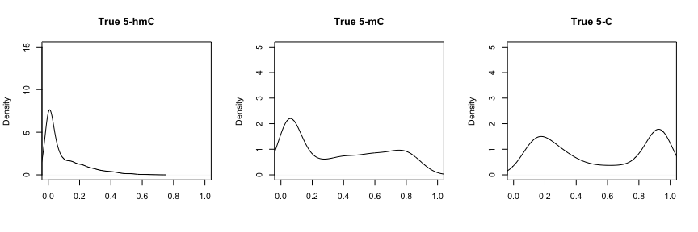
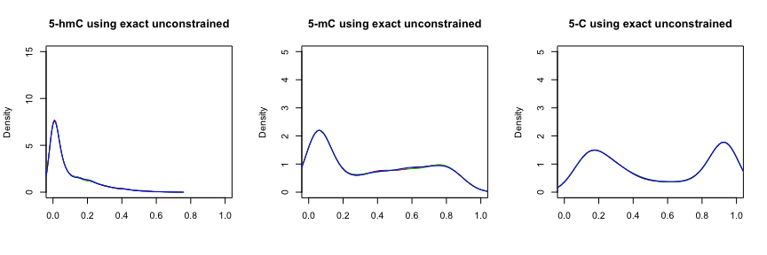
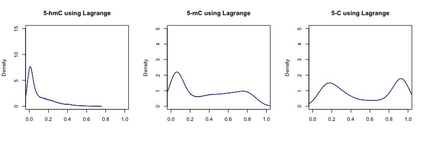
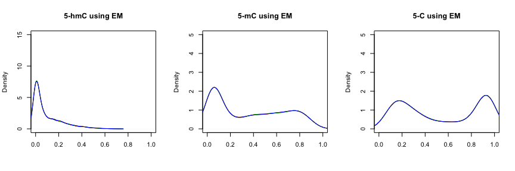
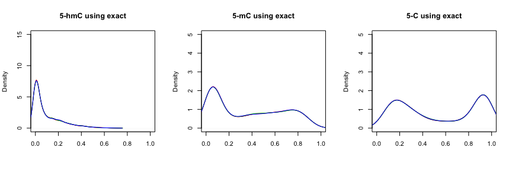

# Introduction


This document presents an example of the usage of the `MLML2R` package for R.

Install the R package using the following commands on the R console:


```r
install.packages("devtools")
devtools::install_github("samarafk/MLML2R")
library(MLML2R)
```


The function `MLML` provides maximum likelihood estimates (MLE) for 5-hmC and 5-mC levels using data from any combination of two of the methods: BS-seq, TAB-seq or oxBS-seq, or combination of all the three methods.

The algorithm implemented in the `MLML` function is based on the Expectation-Maximization (EM) algorithm proposed by [Qu *et al.* (2013)](https://www.ncbi.nlm.nih.gov/pmc/articles/PMC3789553/). In addition, our implementation is optimized, since we derived the exact constrained MLE for 5-mC or 5-hmC levels, and the iterative EM algorithm is not needed. Our improved formulation can, thus, decrease analytic processing time and computational burden, common bottlenecks when processing single-base profiling data from thousands of samples.

Furthermore, our routine is flexible and can be used with both next generation sequencing and Infinium Methylation microarray data in the R-statistical language.


# True proportion


```r
library(MLML2R)
```


True proportions used in the data simulation (`true_parameters_sim2` dataset).




Dataset used in this example was simulated from the above true proportions.


# BS+oxBS+TAB data


```r
# via EM algortihm
results_em <- MLML(Tc = MethylatedBS_sim2 , Uc = UnMethylatedBS_sim2,
                   Lc = UnMethylatedOxBS_sim2, Mc = MethylatedOxBS_sim2,
                   Gc = UnMethylatedTAB_sim2, Hc = MethylatedTAB_sim2,tol=0.00001,iterative = TRUE)

# via Lagrange multiplier approximation
results_lag <- MLML(Tc = MethylatedBS_sim2 , Uc = UnMethylatedBS_sim2,
                   Lc = UnMethylatedOxBS_sim2, Mc = MethylatedOxBS_sim2,
                   Gc = UnMethylatedTAB_sim2, Hc = MethylatedTAB_sim2)
```


```r
all.equal(results_em$hmC,results_lag$hmC)
```

```
## [1] "Mean relative difference: 1.363813e-05"
```

```r
all.equal(results_em$C,results_lag$C)
```

```
## [1] "Mean relative difference: 1.823263e-06"
```

```r
all.equal(results_em$hmC[,1],true_parameters_sim2$p_h)
```

```
## [1] "names for target but not for current"
## [2] "Mean relative difference: 0.04152325"
```

```r
all.equal(results_em$mC[,1],true_parameters_sim2$p_m)
```

```
## [1] "names for target but not for current"
## [2] "Mean relative difference: 0.01683185"
```

```r
all.equal(results_lag$hmC[,1],true_parameters_sim2$p_h)
```

```
## [1] "names for target but not for current"
## [2] "Mean relative difference: 0.04152631"
```

```r
all.equal(results_lag$mC[,1],true_parameters_sim2$p_m)
```

```
## [1] "names for target but not for current"
## [2] "Mean relative difference: 0.0168322"
```


```r
library(microbenchmark)
mbm = microbenchmark(
   lagrange = MLML(Tc = MethylatedBS_sim2 , Uc = UnMethylatedBS_sim2,
                                                             Lc = UnMethylatedOxBS_sim2, Mc = MethylatedOxBS_sim2,
                                                            Gc = UnMethylatedTAB_sim2, Hc = MethylatedTAB_sim2),
   EM = MLML(Tc = MethylatedBS_sim2 , Uc = UnMethylatedBS_sim2,
                            Lc = UnMethylatedOxBS_sim2, Mc = MethylatedOxBS_sim2,
                            Gc = UnMethylatedTAB_sim2, Hc = MethylatedTAB_sim2,tol=0.0001,iterative = TRUE),
   times=10)
mbm
```

```
## Unit: microseconds
##      expr      min       lq      mean    median       uq       max neval
##  lagrange  606.489  616.528  652.1492  633.5775  694.807   720.897    10
##        EM 7202.162 7773.634 8405.2229 8129.4215 8872.485 10195.835    10
```

```r
T = MethylatedBS_sim2
U = UnMethylatedBS_sim2
L = UnMethylatedOxBS_sim2
M = MethylatedOxBS_sim2
G = UnMethylatedTAB_sim2
H = MethylatedTAB_sim2

results_oxBS_TAB_BS_exact <- list()

results_oxBS_TAB_BS_exact$mC <- M/(M+L)
results_oxBS_TAB_BS_exact$hmC <- H/(H+G)
results_oxBS_TAB_BS_exact$C <- U/(U+T)


range(results_oxBS_TAB_BS_exact$mC)
```

```
## [1] 0.01035002 0.95846582
```

```r
range(results_oxBS_TAB_BS_exact$hmC)
```

```
## [1] 0.0000000 0.6842684
```

```r
range(results_oxBS_TAB_BS_exact$C)
```

```
## [1] 0.02967969 0.98232222
```










# BS+oxBS data


```r
# obtain MLE via EM-algorithm for BS+oxBS:
results_em <- MLML(Tc = MethylatedBS_sim2 , Uc = UnMethylatedBS_sim2,
Lc = UnMethylatedOxBS_sim2, Mc = MethylatedOxBS_sim2,iterative=TRUE,tol=0.0001)

# obtain constrained exact MLE for BS+oxBS:
results_exact <- MLML(Tc = MethylatedBS_sim2 , Uc = UnMethylatedBS_sim2,
Lc = UnMethylatedOxBS_sim2, Mc = MethylatedOxBS_sim2)

all.equal(results_em$hmC,results_exact$hmC)
```

```
## [1] "Mean relative difference: 0.002200955"
```


# BS+TAB data


```r
# obtain MLE via EM-algorithm for BS+TAB:
results_em <- MLML(Tc = MethylatedBS_sim2 , Uc = UnMethylatedBS_sim2,
Gc = UnMethylatedTAB_sim2, Hc = MethylatedTAB_sim2,tol=0.0001)

# obtain constrained exact MLE for BS+TAB:
results_exact <- MLML(Tc = MethylatedBS_sim2 , Uc = UnMethylatedBS_sim2,
Gc = UnMethylatedTAB_sim2, Hc = MethylatedTAB_sim2)

all.equal(results_em$hmC,results_exact$hmC)
```

```
## [1] TRUE
```





# TAB+oxBS data


```r
# obtain MLE via EM-algorithm for oxBS+TAB:
results_em <- MLML(Lc = UnMethylatedOxBS_sim2, Mc = MethylatedOxBS_sim2,
Gc = UnMethylatedTAB_sim2, Hc = MethylatedTAB_sim2,iterative=TRUE,tol=0.0001)

# obtain constrained exact MLE for oxBS+TAB:
results_exact <- MLML(Lc = UnMethylatedOxBS_sim2, Mc = MethylatedOxBS_sim2,
Gc = UnMethylatedTAB_sim2, Hc = MethylatedTAB_sim2)

all.equal(results_em$hmC,results_exact$hmC)
```

```
## [1] "Attributes: < Component \"dimnames\": Component 2: target is NULL, current is character >"
## [2] "Mean relative difference: 6.485336e-06"
```


