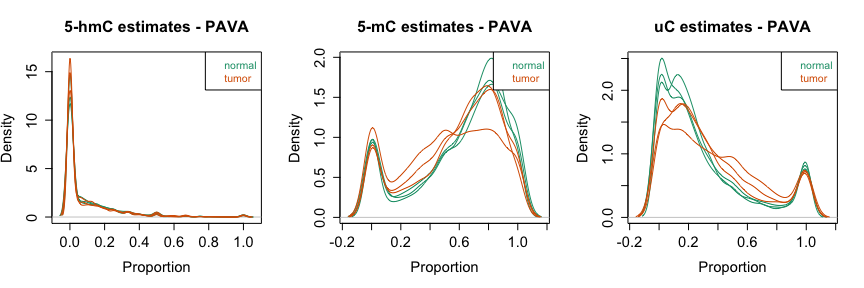
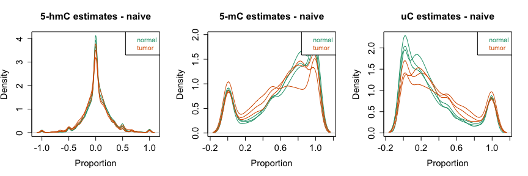
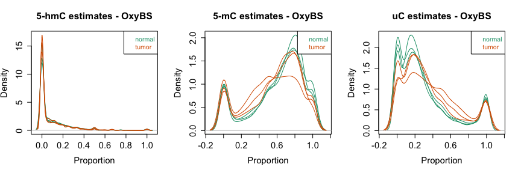
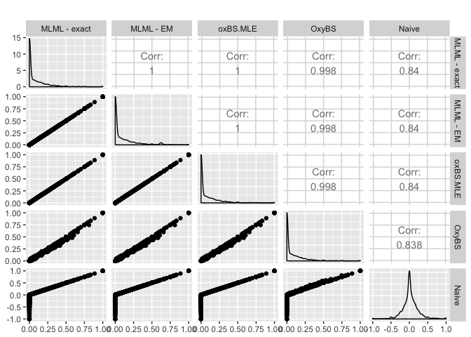

# Introduction


This document presents an example of the usage of the `MLML2R` package for R.

Install the R package using the following commands on the R console:


```r
install.packages("devtools")
devtools::install_github("samarafk/MLML2R")
library(MLML2R)
```

The function `MLML` provides maximum likelihood estimates (MLE) for 5-hmC and 5-mC levels using data from any combination of two of the methods: BS-seq, TAB-seq or oxBS-seq. The function also provides MLE when combining these three methods.


# Getting publicly available data

We will use the dataset from [Li *et al.* (2016)](https://dx.doi.org/10.1101%2Fgr.211854.116), which applied oxBS-seq and BS-seq to genomic DNA extracted from four human liver normal-tumor pairs and three human lung normal-tumor pairs (14 samples total). All libraries were sequenced to an average depth of 15.4 × per CpG cytosine. The dataset is available at GEO accession [GSE70090](https://www.ncbi.nlm.nih.gov/geo/query/acc.cgi?acc=GSE70090).

Platform used: Illumina HiSeq 2000 (Homo sapiens).


To start this example we will need the following packages:


```r
library(GEOquery)
```

which can be installed in R using the commands:

```r
source("http://www.bioconductor.org/biocLite.R")
biocLite(c("GEOquery"))
```

It is usually best practice to start the analysis from the raw data, which in the case of the 450K array is a .IDAT file.
The raw files from \cite{10.1371/journal.pone.0118202} are deposited in GEO and can be downloaded by doing:


```r
getGEOSuppFiles("GSE70090")
untar("GSE70090/GSE70090_RAW.tar", exdir = "GSE70090/data")
head(list.files("GSE70090/data", pattern = "data"))
```


Decompress the compressed IDAT files:


```r
dataFiles <- list.files("GSE70090/data", pattern = "txt.gz$", full = TRUE)
sapply(dataFiles, gunzip, overwrite = TRUE)
```


We need to identify the different samples from different methods: BS-conversion, oxBS-conversion. We can use the file names do extract this information.


```r
files <- list.files("GSE70090/data")
filesfull <- list.files("GSE70090/data",full=TRUE)
tissue <- sapply(files,function(x) strsplit(x,"_")[[1]][2]) # tissue
id <- sapply(files,function(x) strsplit(x,"_")[[1]][3]) # sample id
tmp <- sapply(files,function(x) strsplit(x,"_")[[1]][4]) 
convMeth <- sapply(tmp, function(x) strsplit(x,"\\.")[[1]][1]) # DNA conversion method
group <- ifelse(id %in% c("N1","N2","N3","N4"),"normal","tumor")
id2 <- paste(tissue,id,sep="_")
GSM <- sapply(files,function(x) strsplit(x,"_")[[1]][1]) # GSM
pheno <- data.frame(GSM=GSM,tissue=tissue,id=id2,convMeth=convMeth,group=group,file=filesfull,stringsAsFactors = FALSE)
```

# Lung samples


```r
library(data.table)

# selecting only lung samples
phenoLung <- pheno[pheno$tissue=="lung",]
# order to have all BS samples and then all oxBS samples
phenoLung <- phenoLung[order(phenoLung$convMeth,phenoLung$id),]

# BS
files <- phenoLung$file[phenoLung$convMeth=="BS"]

MethylatedBS    <- do.call(cbind,lapply(files,function(fn) fread(fn,data.table=FALSE,select=c("methylated_read_count"))))

TotalBS    <- do.call(cbind,lapply(files,function(fn) fread(fn,data.table=FALSE,select=c("total_read_count"))))

UnMethylatedBS <- TotalBS - MethylatedBS

#tmp <- fread(files[1], data.table=FALSE, select=c("chr","position"))
#CpG <- paste(tmp[,1],tmp[,2],sep="-")

#rownames(MethylatedBS) <- CpG 
#rownames(UnMethylatedBS) <- CpG

colnames(MethylatedBS) <- phenoLung$id[phenoLung$convMeth=="BS"]
colnames(UnMethylatedBS) <- phenoLung$id[phenoLung$convMeth=="BS"]

save(MethylatedBS,UnMethylatedBS,file="BS-seq.Rds")


# oxBS
files <- phenoLung$file[phenoLung$convMeth=="oxBS"]

MethylatedOxBS    <- do.call(cbind,lapply(files,function(fn) fread(fn,data.table=FALSE,select=c("methylated_read_count"))))

TotalOxBS    <- do.call(cbind,lapply(files,function(fn) fread(fn,data.table=FALSE,select=c("total_read_count"))))

UnMethylatedOxBS <- TotalOxBS - MethylatedOxBS

#tmp <- fread(files[1], data.table=FALSE, select=c("chr","position"))
#CpG <- paste(tmp[,1],tmp[,2],sep="-")

#rownames(MethylatedoxBS) <- CpG 
#rownames(UnMethylatedoxBS) <- CpG

colnames(MethylatedOxBS) <- phenoLung$id[phenoLung$convMeth=="oxBS"]
colnames(UnMethylatedOxBS) <- phenoLung$id[phenoLung$convMeth=="oxBS"]

save(MethylatedOxBS,UnMethylatedOxBS,file="oxBS-seq.Rds")
```


# Using the `MLML2R` package

After all the preprocessing procedures, we now can use the `MLML2R` package to obtain the maximum likelihood estimates for the 5-hmC and 5-mC levels.

Install the R package using the following commands on the R console:


```r
install.packages("devtools")
devtools::install_github("samarafk/MLML2R")
```


Getting the MLE estimates using PAVA:


```r
load("oxBS-seq.Rds")
load("BS-seq.Rds")

aa <- sample(1:dim(MethylatedBS)[1],5000)
library(MLML2R)
results_exact <- MLML(T.matrix = as.matrix(MethylatedBS[aa,]), 
                   U.matrix = as.matrix(UnMethylatedBS[aa,]), 
                   L.matrix = as.matrix(UnMethylatedOxBS[aa,]), 
                   M.matrix = as.matrix(MethylatedOxBS[aa,]))

#results_em <- MLML(T.matrix = as.matrix(MethylatedBS[aa,]), 
#                   U.matrix = as.matrix(UnMethylatedBS[aa,]), 
#                   L.matrix = as.matrix(UnMethylatedOxBS[aa,]), 
#                   M.matrix = as.matrix(MethylatedOxBS[aa,]),
#                   iterative=TRUE)


source("testeMLML/MLML2R.R")

results_exact1 <- MLML2(T.matrix = as.matrix(MethylatedBS[aa,]), 
                   U.matrix = as.matrix(UnMethylatedBS[aa,]),                                    L.matrix = as.matrix(UnMethylatedOxBS[aa,]), 
                   M.matrix = as.matrix(MethylatedOxBS[aa,]))

results_em1 <- MLML2(T.matrix = as.matrix(MethylatedBS[aa,]), 
                   U.matrix = as.matrix(UnMethylatedBS[aa,]),                                    L.matrix = as.matrix(UnMethylatedOxBS[aa,]), 
                   M.matrix = as.matrix(MethylatedOxBS[aa,]),
                   iterative=TRUE)
```


Plot of the results (we have 6 samples)




# Other methods to obtain the estimates

## Naive estimates

The naive approach to obtain 5-hmC levels is $\beta_{BS} -  \beta_{OxBS}$. This approach results in negative values for the 5-hmC levels.


```r
beta_BS <- as.matrix(MethylatedBS[aa,]/(MethylatedBS[aa,]+UnMethylatedBS[aa,]))
beta_OxBS <- as.matrix(MethylatedOxBS[aa,]/(MethylatedOxBS[aa,]+UnMethylatedOxBS[aa,]))
hmC_naive <- beta_BS-beta_OxBS
C_naive <- 1-beta_BS
mC_naive <- beta_OxBS
```




## `OxyBS` estimates

For the specific case where only ox-BS and BS data are available, `OxyBS` package from [Houseman *et al.* (2016)](https://www.ncbi.nlm.nih.gov/pmc/articles/PMC4978924/) can be use to obtain estimates.


```r
library(OxyBS)

# Methylated signals from the BS and oxBS arrays
methBS <- MethylatedBS[aa,]
methOxBS <- MethylatedOxBS[aa,]
# Unmethylated signals from the BS and oxBS arrays
unmethBS <- UnMethylatedBS[aa,]
unmethOxBS <- UnMethylatedOxBS[aa,]

# Calculate Total Signals
signalBS <- methBS+unmethBS
signalOxBS <- methOxBS+unmethOxBS

# Calculate Beta Values
betaBS <- methBS/signalBS
betaOxBS <- methOxBS/signalOxBS

####################################################
# 4. Apply fitOxBS function to preprocessed values
####################################################

# Select the number of CpGs and Subjects to which the method will be applied 
nCpGs <- dim(unmethOxBS)[1]
nSpecimens <- dim(unmethOxBS)[2]

# Create container for the OxyBS results
MethOxy <- array(NA,dim=c(nCpGs,nSpecimens,3))
dimnames(MethOxy) <- list(
  rownames(methBS)[1:nCpGs],
  colnames(methBS)[1:nSpecimens], c("C","5mC","5hmC"))

# Process results (one array at a time, slow)
for(i in 1:nSpecimens){
MethOxy[,i,] <-fitOxBS(betaBS[,i],betaOxBS[,i],signalBS[,i],signalOxBS[,i])
}
```

```
## 5000 
## 5000 
## 5000 
## 5000 
## 5000 
## 5000
```


Plot of the results (we have 4 replicates)


```r
par(mfrow =c(1,3))
densityPlot(MethOxy[,,3],main= "5-hmC estimates - OxyBS",cex.axis=1.4,cex.main=1.5,cex.lab=1.4,xlab="Proportion",sampGroups=c(rep("normal",3),rep("tumor",3)))
densityPlot(MethOxy[,,2],main= "5-mC estimates - OxyBS",cex.axis=1.4,cex.main=1.5,cex.lab=1.4,xlab="Proportion",sampGroups=c(rep("normal",3),rep("tumor",3)))
densityPlot(MethOxy[,,1],main= "uC estimates - OxyBS",cex.axis=1.4,cex.main=1.5,cex.lab=1.4,xlab="Proportion",sampGroups=c(rep("normal",3),rep("tumor",3)))
```



## `oxBS.MLE` estimates

`ENmix` package had the function `oxBS.MLE` from [Xu *et al.* (2016)](https://www.ncbi.nlm.nih.gov/pubmed/27522082) that can be uses to obtain estimates for the specific case where ox-BS and BS data are available.


```r
beta_BS <- as.matrix(MethylatedBS[aa,]/(MethylatedBS[aa,]+UnMethylatedBS[aa,]))
beta_OxBS <- as.matrix(MethylatedOxBS[aa,]/(MethylatedOxBS[aa,]+UnMethylatedOxBS[aa,]))
N_BS <- as.matrix(MethylatedBS[aa,]+UnMethylatedBS[aa,])
N_OxBS <- as.matrix(MethylatedOxBS[aa,]+UnMethylatedOxBS[aa,])
colnames(beta_BS) <- c("N1","N2","N3","T1","T2","T3")
colnames(beta_OxBS) <- c("N1","N2","N3","T1","T2","T3")
colnames(N_BS) <- c("N1","N2","N3","T1","T2","T3")
colnames(N_OxBS) <- c("N1","N2","N3","T1","T2","T3")

library(ENmix)
oxBSMLEresults <- oxBS.MLE(beta.BS=beta_BS,beta.oxBS=beta_OxBS,
                           N.BS=N_BS,N.oxBS=N_OxBS)
```


## Comparison of 5-hmC estimates from different methods


```
##             x            y          z            t             w
## 1  0.00000000 2.106090e-06 0.00000000 1.034765e-05 -0.0114942529
## 2  0.02898551 2.898568e-02 0.02898551 2.978900e-02  0.0289855072
## 3  0.00000000 4.142422e-04 0.00000000 1.099311e-05 -0.0008944544
## 4  0.00000000 8.917197e-09 0.00000000 2.948675e-06 -0.3738095238
## 5  0.00000000 2.538461e-08 0.00000000 1.612550e-05 -0.0769230769
## 6  0.04347826 4.347826e-02 0.04347826 4.346826e-02  0.0434782609
## 7  0.00000000 0.000000e+00 0.00000000 6.666667e-06 -0.5000000000
## 8  0.08333333 8.333337e-02 0.08333333 7.598255e-02  0.0833333333
## 9  0.33974359 3.397436e-01 0.33974359 3.135257e-01  0.3397435897
## 10 0.00000000 0.000000e+00 0.00000000 9.999900e-06  0.0000000000
```




## Comparison of processing times from different methods


```r
library(OxyBS)
library(microbenchmark)
library(MLML2R)
signalBS <- MethylatedBS+UnMethylatedBS
signalOxBS <- MethylatedOxBS+UnMethylatedOxBS
betaBS <- MethylatedBS/signalBS
betaOxBS <- MethylatedOxBS/signalOxBS

nCpGs <- dim(UnMethylatedOxBS)[1]
nSpecimens <- dim(UnMethylatedOxBS)[2]
MethOxy1 <- array(NA,dim=c(nCpGs,nSpecimens,3))
dimnames(MethOxy1) <- list(
  rownames(MethylatedBS)[1:nCpGs],
  colnames(MethylatedBS)[1:nSpecimens], c("C","5mC","5hmC"))

oxyBS <- function()
{
  for(i in 1:nSpecimens){
MethOxy1[,i,] <-fitOxBS(betaBS[,i],betaOxBS[,i],signalBS[,i],signalOxBS[,i])
  }
}

mbm = microbenchmark(
  EXACT = MLML(T.matrix = MethylatedBS[aa,] , U.matrix = UnMethylatedBS[aa,], L.matrix = UnMethylatedOxBS[aa,], 
               M.matrix = MethylatedOxBS[aa,]),
  EM = MLML2(T.matrix = MethylatedBS[aa,] , U.matrix = UnMethylatedBS[aa,], L.matrix = UnMethylatedOxBS[aa,], 
               M.matrix = MethylatedOxBS[aa,],iterative=TRUE),
  oxBSMLE = oxBS.MLE(beta.BS=beta_BS,beta.oxBS=beta_OxBS,
                     N.BS=N_BS,N.oxBS=N_OxBS),
  oxyBS_res = oxyBS(),
  times=1)
```


